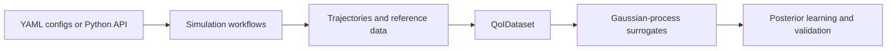

# Bayesic Force Fields

<p align="center">
  
</p>

[](https://vojtechkostal.github.io/BayesicForceFields/)
[](https://pubs.acs.org/doi/10.1021/acs.jctc.5c02051)
[](https://github.com/vojtechkostal/BayesicForceFields/releases)
[](https://github.com/vojtechkostal/BayesicForceFields/blob/main/LICENSE)

Bayesic Force Fields (BFF) is a Python toolkit for learning fixed-charge
molecular force-field parameters from molecular-dynamics observables. It
coordinates simulation campaigns, trajectory analysis, surrogate fitting, and
Bayesian posterior learning.

Full documentation:
[vojtechkostal.github.io/BayesicForceFields](https://vojtechkostal.github.io/BayesicForceFields/)

## Workflow

```text
build -> prepare-assets -> evaluate-snapshots
                       -> sample -> analyze -> fit -> learn -> validate
```

The command-line interface guides a force-field model from prepared molecular
systems to sampled trajectories, quantities of interest, surrogate models, and
validated posterior samples. See the [CLI reference](https://vojtechkostal.github.io/BayesicForceFields/cli/)
for the
individual commands.

## Installation

Create an environment, install the [PyTorch build appropriate for your
machine](https://pytorch.org/get-started/locally/), and then install BFF:

```bash
mamba create -n bfflearn python=3.10 pip
mamba activate bfflearn
pip install bfflearn
```

For Jupyter notebooks, install the optional notebook tools:

```bash
pip install "bfflearn[notebook]"
```

> **WARNING:** GPU-enabled PyTorch must be installed separately. Use the
> [official PyTorch installation selector](https://pytorch.org/get-started/locally/)
> to choose the command matching your CUDA version before running fitting,
> learning, or the posterior notebooks.

Full MD workflows also require GROMACS. CP2K and PLUMED are needed only for the
stages that use them. See the [installation guide](https://vojtechkostal.github.io/BayesicForceFields/installation/)
for
details, CUDA guidance, and the repository-development setup.

## Quick Start

Install the example tree and choose a walkthrough:

```bash
bff examples
cd examples/acetate
```

- [Acetate](https://github.com/vojtechkostal/BayesicForceFields/tree/main/examples/acetate):
  complete staged MD workflow.
- [Arbitrary data](https://github.com/vojtechkostal/BayesicForceFields/tree/main/examples/arbitrary-data):
  notebook using existing tabular
  simulation results and targets.
- [Neon Mie](https://github.com/vojtechkostal/BayesicForceFields/tree/main/examples/neon-mie-lgpmd):
  notebook using published RDF data.

The [examples guide](https://vojtechkostal.github.io/BayesicForceFields/examples/)
explains which starting point fits your data. The
[acetate walkthrough](https://vojtechkostal.github.io/BayesicForceFields/examples/acetate/)
shows the full command sequence.

## Supported Parameters

BFF currently updates and learns four GROMACS force-field parameter families:

| Parameter | Bound label example |
| --- | --- |
| Partial charge | `charge O1 O2` |
| Lennard-Jones sigma | `sigma OW` |
| Lennard-Jones epsilon | `epsilon OW` |
| Function-9 dihedral force constant | `dihedraltype9_3_180` |

Multiple names in one label share one learned value. Charges can additionally
participate in hierarchical residue- or system-level constraints. The [sample
configuration reference](https://vojtechkostal.github.io/BayesicForceFields/configuration/sample/#parameter-labels)
documents the complete syntax and matching rules.

## Architecture



The [architecture guide](https://vojtechkostal.github.io/BayesicForceFields/architecture/)
describes the package modules, workflow stages, persisted artifacts, and
repository layout.

## Documentation

- [Installation](https://vojtechkostal.github.io/BayesicForceFields/installation/)
- [Examples](https://vojtechkostal.github.io/BayesicForceFields/examples/)
- [Configuration reference](https://vojtechkostal.github.io/BayesicForceFields/configuration/build/)
- [Architecture](https://vojtechkostal.github.io/BayesicForceFields/architecture/)
- [Changelog](https://github.com/vojtechkostal/BayesicForceFields/blob/main/CHANGELOG.md)
- [Development](https://vojtechkostal.github.io/BayesicForceFields/development/)
- [Contributing](https://github.com/vojtechkostal/BayesicForceFields/blob/main/CONTRIBUTING.md)
- [Support](https://github.com/vojtechkostal/BayesicForceFields/blob/main/SUPPORT.md)
- [Security](https://github.com/vojtechkostal/BayesicForceFields/blob/main/SECURITY.md)

## Citation

If you use BFF, please cite:

> Kostal, V.; Shanks, B. L.; Jungwirth, P.; Martinez-Seara, H.
> Bayesian Learning for Accurate and Robust Biomolecular Force Fields.
> *J. Chem. Theory Comput.* **2026**, *22* (5), 2652-2663.
> [https://doi.org/10.1021/acs.jctc.5c02051](https://doi.org/10.1021/acs.jctc.5c02051)

The exact publication snapshot is archived as
[`v0.0.1`](https://github.com/vojtechkostal/BayesicForceFields/tree/v0.0.1).

## License

BFF is distributed under the
[GNU GPL v3](https://github.com/vojtechkostal/BayesicForceFields/blob/main/LICENSE).
