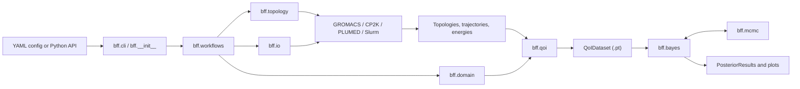

# Architecture

BFF is a staged research-software workflow. Each stage consumes explicit files
and writes artifacts that can be inspected, archived, or reused independently.
This keeps simulation orchestration separate from trajectory analysis and
Bayesian inference.

## Runtime Flow



The CLI and Python API are thin entry points. Workflow modules own the
application-level sequence, while lower layers own reusable domain logic.

## Repository Layout

The abbreviated tree below is a navigation aid rather than an exhaustive file
listing:

```text
BayesicForceFields/
|-- bff/
|   |-- bayes/          # Gaussian processes, likelihoods, and learning
|   |-- domain/         # Parameter, campaign, and constraint models
|   |-- io/             # GROMACS, CP2K, PLUMED, YAML, and scheduler I/O
|   |-- mcmc/           # Torch-native posterior sampling
|   |-- qoi/            # Trajectory analysis and QoI datasets
|   |-- workflows/      # User-facing build-to-validation stages
|   |-- cli.py          # Command-line interface
|   |-- plotting.py     # Visualization helpers
|   `-- topology.py     # Force-field topology modification
|-- docs/               # MkDocs documentation
|-- examples/           # MD and external-data tutorials
|-- tests/              # Unit and integration tests
|-- mkdocs.yml
`-- pyproject.toml
```

## Package Map

| Module | Responsibility |
| --- | --- |
| `bff.__init__` | Public Python API: workflow functions, `Project`, `QoI`, `QoIDataset`, and `PosteriorResults`. |
| `bff.cli` | Typer command-line entry points and shell-completion setup. |
| `bff.workflows` | One package per user-facing stage. Each stage loads configuration, coordinates lower-level modules, and writes explicit artifacts. |
| `bff.workflows._shared` | Shared simulation-campaign staging, configuration parsing, preparation helpers, and scheduler integration. |
| `bff.domain` | Stable data models for parameter specifications, charge constraints, sampling campaigns, trajectories, and simulation biases. |
| `bff.topology` | GROMACS topology handling, system construction, MDAnalysis selections, force-field parameter updates, and charge reconstruction support. |
| `bff.io` | File-format and process boundaries: CP2K, EXTXYZ, MDP, PLUMED, Colvars, logging, schedulers, and YAML/PT helpers. |
| `bff.qoi` | Trajectory analysis, built-in RDF and hydrogen-bond routines, custom routine loading, and serialized `QoIDataset` objects. |
| `bff.bayes` | Local Gaussian-process surrogates, kernels, means, likelihoods, priors, posterior learning, and result handling. |
| `bff.mcmc` | Torch-native Metropolis-Hastings sampling, adaptive proposals, checkpoints, restart support, and convergence diagnostics. |
| `bff.plotting` | Posterior and surrogate visualization. |
| `bff.tools` | Small shared numerical helpers. |

## Workflow Stages

| Command | Main Input | Responsibility | Main Output |
| --- | --- | --- | --- |
| `bff build` | GROMACS topologies, coordinate templates, and MDP files | Build, equilibrate, and seed systems. | `build-manifest.yaml` and seeded trajectories |
| `bff prepare-assets` | Build manifest | Package reusable FFMD inputs and stage CP2K snapshot jobs. | `ffmd/` and `reference/` asset trees |
| `bff evaluate-snapshots` | Staged reference assets | Run CP2K snapshot calculations and collect reference structures. | `train.extxyz`, `valid.extxyz`, and optional isolated-atom energies |
| `bff sample` | FFMD assets, parameter bounds, and charge constraints | Draw parameter vectors and run sampled GROMACS campaigns. | `specs.yaml`, `samples.yaml`, and sampled trajectories |
| `bff analyze` | Sampled and reference trajectories | Compute matching quantities of interest. | One serialized `QoIDataset` per quantity of interest |
| `bff fit` | QoI datasets | Train local Gaussian-process surrogate committees. | One `.lgp` model per quantity of interest |
| `bff learn` | Surrogate models and `specs.yaml` | Assign effective observation counts and run posterior learning with the Torch-native MCMC stack. | Posterior chain, optional checkpoint and priors, parameter marginals, QoI-attributed marginals, and corner plot |
| `bff validate` | Selected parameter samples, `specs.yaml`, and FFMD assets | Rerun chosen posterior samples as an independent campaign. | Validation trajectories and energies |

## Core Artifacts

| Artifact | Meaning |
| --- | --- |
| `build-manifest.yaml` | Handoff from system building to asset preparation. |
| `specs.yaml` | Named parameter bounds and reconstructable hierarchical charge constraints. |
| `samples.yaml` | Explicit sampled force-field parameter vectors. |
| `qoi-<name>.pt` | Training-ready `QoIDataset` with simulation outputs and reference targets. |
| `<name>.lgp` | Trained local Gaussian-process committee for one quantity of interest. |
| `posterior.pt` | Learned posterior chain. |
| `mcmc-checkpoint.pt` | Restartable MCMC state and convergence information. |
| `qoi-marginals.pdf` | Posterior parameter marginals colored by local QoI responsibility. |

## Design Choices

- **Files are interfaces.** Workflow boundaries use inspectable artifacts so
  expensive simulation stages can be resumed, archived, or replaced.
- **Domain models are separate from orchestration.** Constraint reconstruction,
  trajectory records, and QoI datasets remain usable from notebooks and Python
  code without invoking the CLI.
- **External tools stay at the edges.** GROMACS, CP2K, PLUMED, and Slurm
  integration lives in topology, I/O, and workflow modules.
- **Inference is reusable.** `QoIDataset`, `bff.bayes`, and `bff.mcmc` can learn
  from user-provided data without running molecular dynamics inside BFF.

## Where To Start

- To run BFF, start with the [examples](examples/index.md).
- To configure a stage, use the [configuration reference](configuration/build.md).
- To extend analysis, inspect `bff/qoi/routines.py`.
- To contribute code, read the [development guide](development.md).
