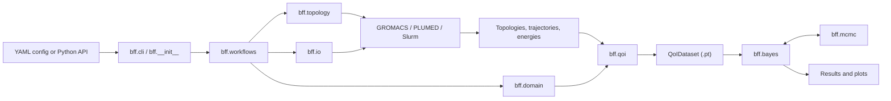

# Architecture

BFF is a staged research-software workflow. Each stage consumes explicit files
and writes artifacts that can be inspected, archived, or reused independently.
This keeps simulation orchestration separate from trajectory analysis and
Bayesian inference.

## Runtime Flow


```mermaid
flowchart LR
    User["YAML config or Python API"] --> Entry["bff.cli / bff.__init__"]
    Entry --> Workflow["bff.workflows"]
    Workflow --> Domain["bff.domain"]
    Workflow --> Topology["bff.topology"]
    Workflow --> IO["bff.io"]
    Topology --> External["GROMACS / PLUMED / Slurm"]
    IO --> External
    External --> Trajectories["Topologies, trajectories, energies"]
    Trajectories --> QoI["bff.qoi"]
    Domain --> QoI
    QoI --> Dataset["QoIDataset (.pt)"]
    Dataset --> Bayes["bff.bayes"]
    Bayes <--> MCMC["bff.mcmc"]
    Bayes --> Results["Results and plots"]
```

The CLI and Python API are thin entry points. Workflow modules own the
application-level sequence, while lower layers own reusable domain logic.

## Repository Layout

The abbreviated tree below is a navigation aid rather than an exhaustive file
listing:

```text
BayesicForceFields/
|-- bff/
|   |-- bayes/          # Gaussian processes, likelihoods, and learning
|   |-- domain/         # Parameter specs, systems, samples, and biases
|   |-- io/             # MDP, PLUMED, Colvars, YAML, and logs
|   |-- mcmc/           # Torch-native posterior sampling
|   |-- qoi/            # Routines, trajectory analysis, and QoI datasets
|   |-- workflows/      # One package per stage, plus campaign/ for MD campaigns
|   |-- cli.py          # Command-line interface
|   |-- gromacs.py      # grompp/mdrun runner with Colvars or PLUMED bias
|   |-- plotting.py     # Visualization helpers
|   |-- slurm.py        # Slurm job arrays and progress
|   `-- topology.py     # Universe preparation and force-field parameter edits
|-- docs/               # MkDocs documentation
|-- examples/           # MD and external-data tutorials
|-- scripts/            # Standalone helpers, e.g. CP2K labeling for MLIPs
|-- tests/              # Unit and integration tests
|-- mkdocs.yml
`-- pyproject.toml
```

## Package Map

| Module | Responsibility |
| --- | --- |
| `bff.__init__` | Public Python API: workflow functions, `Project`, `QoI`, `QoIDataset`, and `Results`. |
| `bff.cli` | Typer command-line entry points and shell-completion setup. |
| `bff.workflows` | One package per user-facing stage. Each stage loads configuration, coordinates lower-level modules, and writes explicit artifacts. |
| `bff.workflows.campaign` | MD campaigns shared by `sample-parameters` and `validate`: configuration, one `run_campaign` flow over a parameter draw (checks, staging, resume or overwrite, local or Slurm runs, collection, provenance), and the per-sample job (`bff md`). |
| `bff.workflows.config` | `ConfigSection`, the typed YAML reader every stage loader uses: unknown-key, type, range, and path checks with uniform error messages. |
| `bff.domain` | Stable data models for parameter specifications, charge constraints, system metadata, the `samples.yaml` manifest, and simulation biases. |
| `bff.topology` | MDAnalysis universes from GROMACS topologies and force-field parameter updates. |
| `bff.gromacs` | One `run_md` used by `build` and campaign jobs; GROMACS always runs in the output directory. |
| `bff.slurm` | Slurm configuration, task scripts, chunked job-array submission, and queue polling. |
| `bff.io` | File formats and helpers: MDP, PLUMED, Colvars, logging, and YAML/PT. |
| `bff.qoi` | Built-in and custom routines with one interface, trajectory opening, and serialized `QoI`/`QoIDataset` objects. |
| `bff.bayes` | Local Gaussian-process surrogates, kernels, means, likelihoods, and priors; `fit` trains surrogate committees, `learning` runs posterior learning, `results` handles posteriors. |
| `bff.mcmc` | Torch-native Metropolis-Hastings sampling, adaptive proposals, checkpoints, restart support, and convergence diagnostics. |
| `bff.plotting` | Posterior and surrogate visualization. |

## Workflow Stages

| Command | Main Input | Responsibility | Main Output |
| --- | --- | --- | --- |
| `bff build` | GROMACS topologies, coordinate templates, and MDP files | Build, equilibrate, seed, and remove virtual sites for reference use. | Self-contained `systems/<system_id>/` directories with a stable `reference/` pair |
| `bff sample-parameters` | FFMD assets, parameter bounds, and charge constraints | Draw parameter vectors and run sampled GROMACS campaigns. | `specs.yaml`, `samples.yaml`, and sampled trajectories |
| `bff build-qoi-datasets` | Sampled and reference trajectories | Compute matching quantities of interest. | One serialized `QoIDataset` per quantity of interest |
| `bff fit-lgp` | QoI datasets | Train fingerprinted local Gaussian-process surrogate committees. | `fit-lgp.log` and `models/<routine>.lgp` |
| `bff learn` | Surrogate models and `specs.yaml` | Assign effective observations and run validated posterior learning. | Fixed `outputs/` artifacts and mandatory `plots/` |
| `bff validate` | A learned posterior or explicit parameter samples, plus build systems | Draw or load parameters and rerun them as an independent campaign. | Campaign-local specs, realized samples, trajectories, and energies |

## Core Artifacts

| Artifact | Meaning |
| --- | --- |
| Build system directory | Fixed-name GROMACS files and virtual-site-free `reference/` topology and coordinates. |
| `specs.yaml` | Named parameter bounds and the linear charge equations that fix implicit charges. |
| `samples.yaml` | `parameter_names`, parameter provenance, and per sample its parameters, status, and outputs (topology, trajectory, stored files) per system. |
| `campaign.yaml` | Job settings shared by every sample; each sample runs as `bff md campaign.yaml <sample_id>`. |
| `samples/<sample_id>/` | `run.out`, `gmx.log`, and one directory per system with the sample's topology and MD outputs. |
| `run.sh`, `slurm/` | Slurm task script and Slurm's own task output. |
| `qoi/<name>.pt` | Training-ready `QoIDataset` with ID-paired outputs, reference targets, `sample_ids`, and `parameter_names`. |
| `<name>.lgp` | Trained local Gaussian-process committee for one quantity of interest, with its `parameter_names`. |
| `outputs/specs.yaml` | Unchanged, portable copy of the learned parameter specification. |
| `outputs/results.pt` | One file with the prior, the posterior chain and its log posterior (MAP), the specification, and per-QoI likelihoods; opened with `Results.load`. |
| `outputs/mcmc.ckpt` | Restartable MCMC state and compatibility fingerprints. |
| `qoi-marginals.pdf` | Posterior parameter marginals colored by local QoI responsibility. |

## Design Choices

- **Stage directories are interfaces.** Fixed layouts and local metadata make
  workflow handoffs visible without duplicating deterministic paths. Expensive
  stages remain independently runnable and archivable.
- **Files are inspectable.** Workflow boundaries use inspectable artifacts so
  expensive simulation stages can be resumed, archived, or replaced.
- **IDs are identities.** System matching is keyed by explicit file-safe IDs;
  display names and YAML order never determine pairing.
- **Domain models are separate from orchestration.** Constraint reconstruction,
  trajectory records, and QoI datasets remain usable from notebooks and Python
  code without invoking the CLI.
- **External tools stay at the edges.** GROMACS, PLUMED, and Slurm
  integration lives in topology, I/O, and workflow modules. Reference MD is
  outside BFF; its only contract is the `reference/` atom order.
- **Inference is reusable.** `QoIDataset`, `bff.bayes`, and `bff.mcmc` can learn
  from user-provided data without running molecular dynamics inside BFF.

## Where To Start

- To run BFF, start with the [examples](examples/index.md).
- To configure a stage, use the [configuration reference](configuration/build.md).
- To extend analysis, inspect `bff/qoi/routines.py`.
- To contribute code, read the [development guide](development.md).
