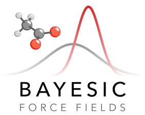

# Bayesic Force Fields



Bayesic Force Fields (BFF) is a command-line workflow for learning
fixed-charge molecular force fields from trajectory observables.

Publication:
[Bayesian Learning for Accurate and Robust Biomolecular Force Fields](https://pubs.acs.org/doi/10.1021/acs.jctc.5c02051)

Preprint:
[arXiv:2511.05398](https://arxiv.org/abs/2511.05398)

For exact reproduction of the published paper data, use the archived Git tag
`v0.0.1`. The current `bfflearn` package is the refactored workflow.
See the [changelog](changelog.md) for post-publication highlights.

## What BFF Does

BFF runs a linear workflow:

```text
build -> prepare-assets -> evaluate-snapshots
                       -> sample -> analyze -> fit -> learn -> validate
```

- `build`: equilibrate systems and run seeded production trajectories
- `prepare-assets`: package FFMD starts and stage CP2K snapshot assets
- `evaluate-snapshots`: run CP2K snapshot jobs
- `sample`: run sampled force-field MD campaigns
- `analyze`: compute quantities of interest from sample and reference data
- `fit`: train surrogate models
- `learn`: infer posterior force-field parameters
- `validate`: rerun selected posterior samples

## Supported Learned Parameters

BFF currently learns GROMACS partial charges, Lennard-Jones sigma and epsilon,
and function-9 dihedral force constants. A single bound can tie multiple atom
names or atom types to one learned value. Charge parameters also support
hierarchical residue- or system-level constraints.

See the [sample configuration reference](configuration/sample.md#parameter-labels)
for the accepted labels, matching rules, and examples.

## Quick Start

Install BFF, copy the example tree, then run the acetate walkthrough:

```bash
mamba create -n bfflearn python=3.10 pip
mamba activate bfflearn
pip install bfflearn

bff examples
cd examples/acetate
```

!!! warning
    Install the PyTorch build that matches your machine separately before
    fitting or learning. Use the
    [official PyTorch selector](https://pytorch.org/get-started/locally/) for
    CPU or CUDA installation commands.

Each example stage has config templates. Copy the needed files into the stage
directory, edit them there, and run BFF from that directory:

```bash
mkdir -p 01-build
cp configs/build-colvars.yaml 01-build/config.yaml
cd 01-build
bff build config.yaml
cd ..

mkdir -p 02-assets
cp configs/prepare-assets.yaml 02-assets/config.yaml
cd 02-assets
bff prepare-assets config.yaml
```

Continue with the stages in the [acetate example](examples/acetate.md).

## Where To Go Next

- [Installation](installation.md)
- [Architecture](architecture.md)
- [Command-line interface](cli.md)
- [Examples overview](examples/index.md)
- [Configuration reference](configuration/build.md)
- [Development](development.md)
- [Contributing](https://github.com/vojtechkostal/BayesicForceFields/blob/main/CONTRIBUTING.md)
- [Support](https://github.com/vojtechkostal/BayesicForceFields/blob/main/SUPPORT.md)
